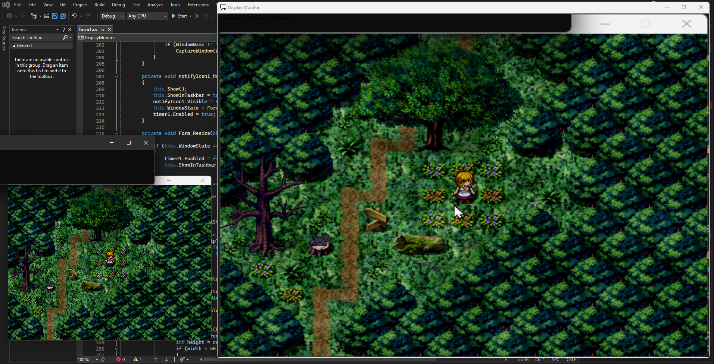

# DisplayMonitor

*Require .Net Farmework 4.8.1*

A program that allow you to display a screen or a program in it, I mainly did this for old games that doesn't allow to resize , with a combination with a virtual screen it would be perfect.

so the idea was to make a virtual screen, then add it to the program , or add the old unresizable app to the program , then put the unresizable app in that hidden screen , and use this program to see what's going on, or incase you have a place to put that app in the same screen , well as long as you can resize this program and use it to play that old game , that's the idea.

Example:

